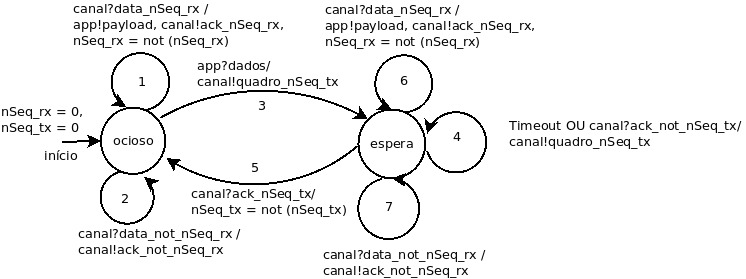

## Tarefa: Modelagem mecanismo ARQ Stop-and-Wait
> fevereiro de 2021, versão discutida com o professor.

A Figura abaixo demonstra a Máquina de Estados Finita (MEF) modelada para representar o funcionamento
do mecanismo ARQ Stop-and-Wait, o qual fará parte do protocolo de enlace em desenvolvimento.

  
  <h3 align="center"> Figura 1 - MEF ARQ Stop-and-Wait. </h3>

**Transição 1)** Permanece no estado *ocioso* se receber do canal de comunicação um quadro com número de sequência **igual** ao valor de nSeq_rx esperado. Realiza a distribuição dos dados para as outras camadas da aplicação, transmite pelo canal um ACK com o mesmo número de sequência e por fim altera o valor de nSeq_rx para o seu inverso (not nSeq_rx).

**Transição 2)** Permanece no estado *ocioso* se receber pelo canal de comunicação um quadro com número de sequência **inverso** ao valor de nSeq_rx esperado. Realiza a transmissão de um ACK pelo canal com o valor inverso de nSeq_rx (not nSeq_rx).

**Transição 3)** Altera para o estado *espera* se receber dados da aplicação. Transmite pelo canal o quadro com número de sequência referente ao valor de nSeq_tx atual.

**Transição 4)** Permanece no estado *espera* caso ocorra um *Timeout* ou receba pela canal um ACK com valor de número de sequência **inverso** ao nSeq_tx esperado. Retransmite o quadro com o valor de nSeq_tx atual.

**Transição 5)** Altera para o estado *ocioso* se receber pelo canal um ACK com valor de número de sequência **igual** ao valor de nSeq_tx esperado. Altera o valor de nSeq_tx para o seu inverso (not nSeq_tx).

**Transição 6)** Mesmo comportamento que a transição 1, porém permanece no estado *espera*.

**Transição 7)** Mesmo comportamento que a transição 2, porém permanece no estado *espera*.
