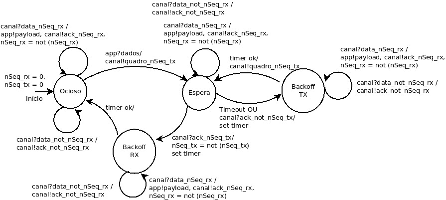

#### Tarefa: Modelagem mecanismo ARQ com Controle de Acesso ao meio
> fevereiro de 2021, versão discutida com o professor.

  
  <h3 align="center"> Figura 1 - MEF mecanismo ARQ com Controle de Acesso ao Meio. </h3>

A Figura acima demonstra a nova MEF implementada na subcamada ARQ. Novos estados foram adicionados, sendo eles BackoffTX e BackoffRX, os quais serão responsáveis por esperar o tempo de retransmissão e de volta para o estado ocioso. 
Essas mudanças foram baseados na tecnologia Aloha visando evitar transmissões simultâneas e consequentemente reduzir a quantidade de colisões entre os pacotes. Uma característica importante do método Aloha é que não há nenhuma espécie de autorização para transmissão entre os pontos do canal, porém o estado BackoffRX foi implementado justamente para isso, "forçando" o ponto que acabou de transmitir esperar um período para transmitir novamente.

