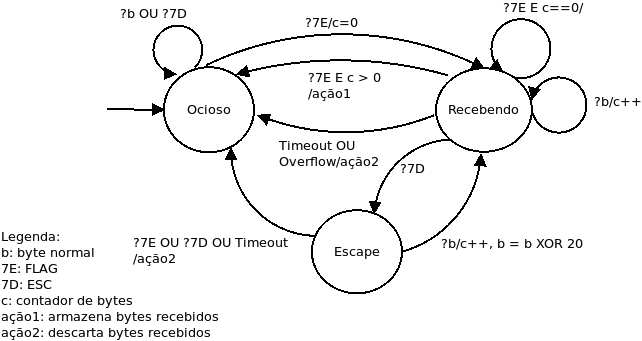

## Tarefa: Modelagem enquadramento
> novembro de 2020, versão discutida com o professor.

Para desenvolvimento da MEF (Máquina de Estados Finita) utilizou-se da abordagem de enquadramento denominada *Sentinela*, cuja o funcionamento consiste em usar padrões de *bits* ou valores especiais em octetos.  Essa abordagem utiliza um octeto especial denominado **Flag** (7E) para demarca o início e fim do quadro. 

Esta técnica também possui o octeto **ESC** (7D), pois sempre que o emissor queira enviar uma mensagem contendo quadros de dados com o mesmo valor de  **Flag** ou **ESC** ocorrerá uma operação XOR 20 com este *byte* e será inserido antes dele o valor de **ESC**, garantindo assim uma funcionalidade íntegra na transmissão dos dados. 

Considerando esta abordagem, de acordo com a sua implementação no protocolo PPP, obtemos a seguinte MEF  descrita pelo diagrama da Figura 1. 

  
  <h3 align="center"> Figura 1 - MEF enquadramento. </h3>

* O processo inicia no estado **Ocioso** e permanece nele mesmo recebendo *bytes* denominados normais (**b**) e *bytes* 7D (ESC).  Ao receber o *byte* 7E (FLAG) o processo altera para o estado **Recebendo**, pois iniciou-se a leitura de um novo quadro. Nessa mudança de estado também começa uma contagem de controle de *byte* através da variável **c**.

* No estado **Recebendo**, caso ocorra a recepção de um *byte* normal o estado permanece o mesmo e há o incremento da variável **c**. Ao receber um *byte* do tipo 7D o estado muda para **Escape** para realizar o tratamento especial do *byte* sucessor, seguindo a regra de realizar a operação XOR 20. Se logo em seguida, receber outro *byte* 7E significa que o anterior era uma *flag* de final de quadro e, que essa é a de início de um novo. Caso ocorra um *Timeout* ou *Overflow* o estado retorna para **Ocioso** e todos os *bytes* recebidos são descartados.

* Estando em **Escape** e recebendo esse *byte* sucessor do tipo **b** o estado volta para **Recebendo** e a variável **c** é incrementada. Caso receba-se um *byte* do tipo 7E, ou 7D ou ocorra um *Timeout* significa que o transmissor não realizou de forma adequada o enquadramento e, dessa forma, todos os *bytes* recebidos até essa etapa são descartados e o estado retorna para **Ocioso*.*

* Por fim, ao voltar para o estado **Recebendo** e ocorrer a recepção do *byte* 7E e juntamente a variável **c** ser maior que zero, a leitura do quadro finalizou e o processo retorna para **Ocioso**.
